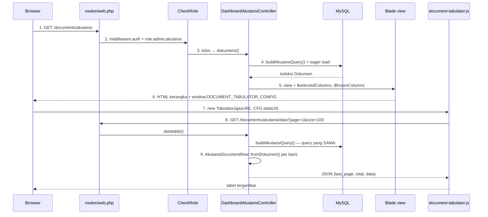

# Peta Alur — Dari Klik Sampai Tabel Terisi

Studi kasus: **Daftar Dokumen Akutansi** (`/documents/akutansi`).
Semua nomor baris di bawah sudah diverifikasi ke kode per 2026-07-30.

Pola ini dipakai **lima role** (operator, akutansi, perpajakan, verifikasi, pembayaran).
Kuasai satu = kuasai lima. Yang berbeda hanya nama kelas dan endpoint-nya.

---

## Ringkasan satu kalimat

> Browser meminta **halaman kosong** dulu, lalu meminta **datanya** lewat permintaan kedua
> berbentuk JSON; semua aturan bisnis (status, deadline, boleh-edit) dihitung **di server**,
> JavaScript hanya menggambar.

Kalau Anda cuma hafal satu kalimat dari seluruh dokumen ini, hafalkan yang di atas.

---

## Diagram



---

## Sembilan kotak, satu per satu

### Kotak 1 — Rute

`routes/web.php:435-443`

```php
Route::middleware(['auth', 'role:admin,akutansi'])
    ->prefix('documents/akutansi')
    ->name('documents.akutansi.')
    ->group(function () {
        Route::get('/',       [DashboardAkutansiController::class, 'dokumens'])->name('index');
        Route::get('/data',   [DashboardAkutansiController::class, 'datatable'])->name('data');
        Route::get('/export', [DashboardAkutansiController::class, 'exportDocuments'])->name('export');
    });
```

Tiga hal yang harus bisa Anda tunjuk di sini:

- **`middleware([...])`** — gerbang. Dijelaskan di kotak 2.
- **`prefix`** — semua URL di dalam grup diawali `documents/akutansi`.
- **`name`** — semua nama rute diawali `documents.akutansi.`, jadi rute pertama bernama
  lengkap `documents.akutansi.index`. Nama inilah yang dipakai `route('documents.akutansi.data')`
  di Blade, **bukan** URL mentah. Kalau URL-nya berubah, Blade tidak perlu disentuh.

> **Pertanyaan penguji yang mungkin:** *"Kenapa tidak tulis URL langsung di HTML?"*
> Jawab: karena URL bisa berubah; nama rute tidak. Satu tempat diubah, semua ikut.

### Kotak 2 — Middleware (gerbang hak akses)

`app/Http/Middleware/CheckRole.php:21-71`

```php
public function handle(Request $request, Closure $next, string ...$roles): Response
{
    if (!Auth::check()) { /* ... redirect /login ... */ }

    $userRole      = strtolower($user->role);
    $requiredRoles = array_map('strtolower', $roles);

    if (empty($roles) || !in_array($userRole, $requiredRoles, true)) {
        Log::warning('Unauthorized access attempt - Role mismatch', [...]);
        return redirect('/login')->with('error', 'Anda tidak memiliki akses ...');
    }

    return $next($request);   // ← lolos, teruskan ke controller
}
```

- `string ...$roles` menampung `admin` dan `akutansi` dari `role:admin,akutansi`.
- Kalau permintaannya AJAX (`$request->expectsJson()`), balasannya **JSON 403**, bukan
  redirect — penting supaya tabel tidak menerima HTML halaman login lalu error aneh.
- Kegagalan dicatat ke log (`Log::warning`), jadi percobaan akses tak sah terekam.

> **Kenapa di middleware, bukan di dalam controller?** Karena kalau ditaruh di controller,
> suatu hari ada method baru yang lupa dicek. Middleware adalah satu gerbang untuk seluruh
> grup — tidak bisa lupa.

### Kotak 3 — Controller, halaman

`app/Http/Controllers/DashboardAkutansiController.php:337`

`dokumens()` menyiapkan halaman. Perhatikan baris **342**:

```php
$query = $this->buildAkutansiQuery($request);
```

### Kotak 4 — Query builder (jantungnya)

`DashboardAkutansiController.php:149`

Komentarnya sendiri menyebut ini **sumber tunggal**:

```php
$query = Dokumen::query()
    ->where('status', '!=', 'returned_to_bidang')
    ->excludeCsvImports()
    ->with(['dokumenPos', 'dokumenPrs', 'dibayarKepadas']);
```

Tiga hal penting:

1. **`->with([...])` = eager loading.** Tanpa ini, mengambil "Dibayar Kepada" untuk 100
   baris akan menembak database 100 kali (masalah **N+1**). Dengan ini: 1 query untuk
   dokumen + 1 query untuk semua penerimanya. Ini jawaban Anda kalau ditanya optimasi.
2. **`excludeCsvImports()` adalah *scope*** — method di model (`app/Models/Dokumen.php:241`)
   yang bisa dirantai ke query. Gunanya memberi nama pada potongan kondisi WHERE supaya
   tidak disalin-salin.
3. Method ini dipanggil **tiga** tempat: `dokumens()` (baris 342), `datatable()` (baris 44),
   `exportDocuments()` (baris 108). Itulah sebabnya isi tabel dan isi file Excel **selalu
   sama** — bukan kebetulan, tapi karena filternya satu sumber.

> Ini salah satu jawaban terbaik yang bisa Anda berikan saat ditanya *"apa yang Anda
> perbaiki dari kode sebelumnya?"*

### Kotak 5 — View mengoper data ke JavaScript

`resources/views/akutansi/dokumens/daftarAkutansiTabulator.blade.php` — **hanya 109 baris**.

Perhatikan: **tidak ada satu pun `<tr>` di file ini.** Yang ada cuma tempat kosong
(baris 73):

```blade
<div id="akutansiTabulatorTable" class="doc-tabulator"></div>
```

Data dioper ke JavaScript lewat satu jembatan (baris 100):

```blade
<script>window.DOCUMENT_TABULATOR_CONFIG = @json($configArray);</script>
```

`$configArray` dirakit di baris 16-42. Isinya antara lain:

| Kunci | Baris | Guna |
|---|---|---|
| `mountId` | 17 | id div tempat tabel digambar — **beda per role**, ini yang memisahkan penyimpanan preferensi antar-role |
| `dataUrl` | 18 | URL permintaan kedua |
| `csrf` | 21 | token anti-CSRF untuk aksi simpan |
| `columns` | 25 | daftar kolom yang harus ditampilkan |
| `extraColumns` | 30-33 | kolom tetap khas akutansi: **Deadline** dan **Status** |

> `@json()` itu Blade yang mengubah array PHP jadi objek JavaScript, sekaligus meloloskan
> karakter berbahaya. **Jangan** jawab "saya echo langsung" — itu celah XSS.

### Kotak 6 — Mesin tabel

`public/js/document-tabulator.js:1005-1025`

```js
const table = new Tabulator(mountEl(), {
    ajaxURL: CFG.dataUrl,
    progressiveLoad: 'scroll',
    progressiveLoadDelay: 200,
    persistenceID: PERSIST_ID,
});
```

- `progressiveLoad: 'scroll'` — data diambil sepotong-sepotong sambil digulir, bukan
  sekaligus. Ini jawaban untuk *"bagaimana kalau datanya 100.000 baris?"*
- File ini **satu** dipakai lima role. Dulu tiap role punya tabelnya sendiri yang ~73%
  hasil salin-tempel.

### Kotak 7 — Permintaan kedua

`GET /documents/akutansi/data?page=1&size=100` → `datatable()` di baris **42-64**:

```php
$size = (int) $request->input('size', 100);
$size = ($size > 0 && $size <= 200) ? $size : 100;   // ← batas atas, cegah minta sejuta baris
$page = max(1, (int) $request->input('page', 1));

$paginator = $query->paginate($size, ['*'], 'page', $page);

$data = collect($paginator->items())
    ->map(fn ($d) => AkutansiDocumentRow::fromDokumen($d, $handlerOptions, $viewerRole))
    ->all();

return response()->json([
    'last_page' => $paginator->lastPage(),
    'total'     => $paginator->total(),
    'data'      => $data,
]);
```

Nama field `last_page`/`total`/`data` **bukan pilihan bebas** — itu yang dicari Tabulator.

Perhatikan juga baris **52**: `buildAkutansiHandlerOptions()` dipanggil **sekali**, di luar
`map()`. Kalau dipanggil di dalam, daftar bagian akan di-query 100 kali per halaman.

### Kotak 8 — DTO: mengubah baris database jadi baris tabel

Dua kelas, hubungan pewarisan:

```
App\Support\DocumentRow          (abstract, 123 baris)  ← milik bersama 5 role
        └── AkutansiDocumentRow  (278 baris)            ← tambahan khas akutansi
```

**`DocumentRow::baseRow()`** (`app/Support/DocumentRow.php:24`) mengerjakan yang dibutuhkan
semua role: format rupiah, gabung relasi, format tanggal, sanitasi link.

Contoh yang enak dijelaskan — `formatDates()` di baris **83-122**: peta kolom → format,
lalu tiap nilai kosong jadi `'-'`, dan parsing dibungkus `try/catch` supaya satu tanggal
rusak tidak menjatuhkan seluruh halaman.

**`AkutansiDocumentRow::fromDokumen()`** (`app/Support/AkutansiDocumentRow.php:25`) memanggil
induknya lalu menambah yang khas akutansi:

```php
$row = static::baseRow($dokumen, $handlerOptions, $viewerRole);
// ...
$row['status_badge'] = static::buildStatusBadge($dokumen, $isLocked);
$row['deadline']     = static::buildDeadline($dokumen);
```

`buildStatusBadge()` (baris 59-120+) adalah rentetan `if` yang mengembalikan objek siap
render, misalnya baris 113:

```php
return ['class' => 'badge-proses', 'icon' => null, 'text' => '⏳ Sedang Diproses', 'link' => null];
```

> **Inilah keputusan desain paling penting untuk dijelaskan.** Teks "⏳ Sedang Diproses"
> ditentukan **di PHP**, bukan di JavaScript. Alasannya tiga:
> 1. Aturan bisnis hidup di satu tempat, tidak tersebar di server dan klien.
> 2. Bisa diuji otomatis tanpa browser — lihat `tests/Unit/AkutansiDocumentRowTest.php`.
> 3. JavaScript tidak bisa dipercaya; ia berjalan di komputer pengguna dan bisa diubah.

### Kotak 9 — Kembali ke browser

Tabulator menerima JSON, memanggil *formatter* per kolom, tabel tergambar. Formatter
`akutansiStatus` (didaftarkan di view baris 32) tidak berpikir — ia hanya membaca
`row.status_badge.text` dan `row.status_badge.class`.

---

## Latihan menghafal (5 menit, ulangi tiap hari)

Tutup dokumen ini, lalu ucapkan dengan suara keras:

1. Rute — `routes/web.php`, grup middleware `auth` + `role`
2. Middleware `CheckRole` — tolak atau teruskan
3. Controller `dokumens()` — siapkan halaman
4. `buildAkutansiQuery()` — sumber tunggal filter, eager load lawan N+1
5. Blade — kerangka kosong + `window.DOCUMENT_TABULATOR_CONFIG`
6. `document-tabulator.js` — `new Tabulator`, `ajaxURL`, progressive load
7. Permintaan kedua `/data` → `datatable()` → paginate
8. `AkutansiDocumentRow` mewarisi `DocumentRow` — badge & deadline dihitung server
9. JSON balik, formatter menggambar

Kalau nomor 4 dan 8 lancar, sisanya akan mengalir sendiri. Dua itu yang paling sering
ditanya lanjutannya.
